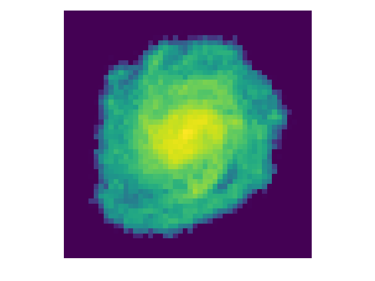

# Prediction of Ram Pressure Stripping (RPS) parameters with CNNs

## Description

We have trained CNN models to predict RPS parameters (IGM density rho\_igm and relative velocity v\_rel) from 2D density and kinematic maps of disc galaxies undergoing RPS.

## Usage

We provide a sample of images which can be used for testing our trained model. 

1. `pip install -r requirements.txt`
2. Install pre-trained model.
4. `python src/predict.py`
